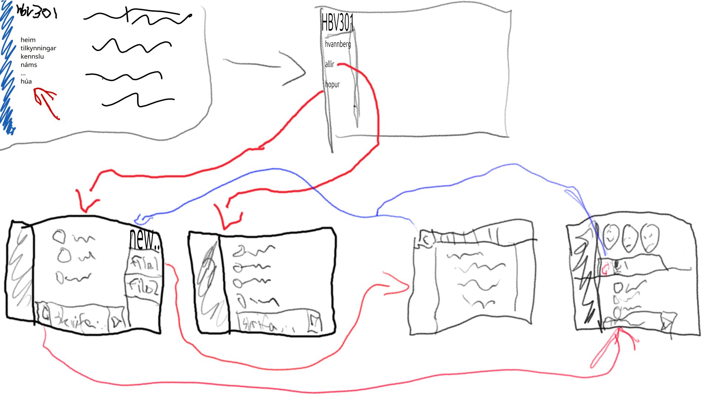

# Áætlun fyrir kröfugreiningarfund

## Markmið

- Markmið fundarins er að safna upplýsingum um þarfir og markmið hóps 9 varðandi aðgangsstýrikerfisins þeirra. Við viljum skilja hvaða notendur nota kerfið og hvaða aðgerðir það þarf að bjóða upp á, og hvaða kerfi það þarf að tengjast.

## Áætlaður staður og stund fyrir fundinn 

Discord, 12. október 2025 kl 17:00

## Þátttakendur og hlutverk
- Facilitator: Dagbjört stýrði fundinum
- Ritari: Sigurður var ritari hópsins
- Viðskiptavinir/hagsmunaaðilar: Hópur 9, voru viðskiptavinirnir.

## Aðferð kröfusöfnunar

Aðferð kröfusöfnunar okkar var viðtal, þar sem við spurðum þau spurningar um kerfið. t.d.
- ástæðuna afhverju þau völdu þetta kerfi.
- Markmið kerfisins,
- Helstu notendur kerfisins.
- Kerfi sem tengjast þeirra kerfi.
- Öryggiskröfur og takmarkanir.

## Líkön til að kveikja umræðu, skjöl og kerfi 

## Dagskrá/Tímalína
- 17:00 - 17:30 Viðtal þar sem hópur 9 var að spyrja okkur spurningar
- 17:30 - 18:00 Viðtal þar sem við vorum að spyrja þau um spurningar

## Áætlaðar afurðir sem koma út úr kröfusöfnuninni 
- listi af notendakröfum
- listi af virkniskröfum
- listi af gæðakröfum
- listi af viðskiptareglum
- usecase
- mismunandi notendur
- afhverju þau völdu þetta verkefni
- þriðja aðilla kerfi
- fídusar

## Áhætta sem getur hindrað kröfusöfnun 
- ónákvæmar eða óljósar lýsingar frá viðskiptavinum.
- Takmarkaður tími fyrir viðtalið sem gæti valdið því að ekki náist að spyrja allar spurningar.
- Misskilningur vegna tæknilegra hugtaka eða mismunandi skilnings á umfangi verkefnisins.
